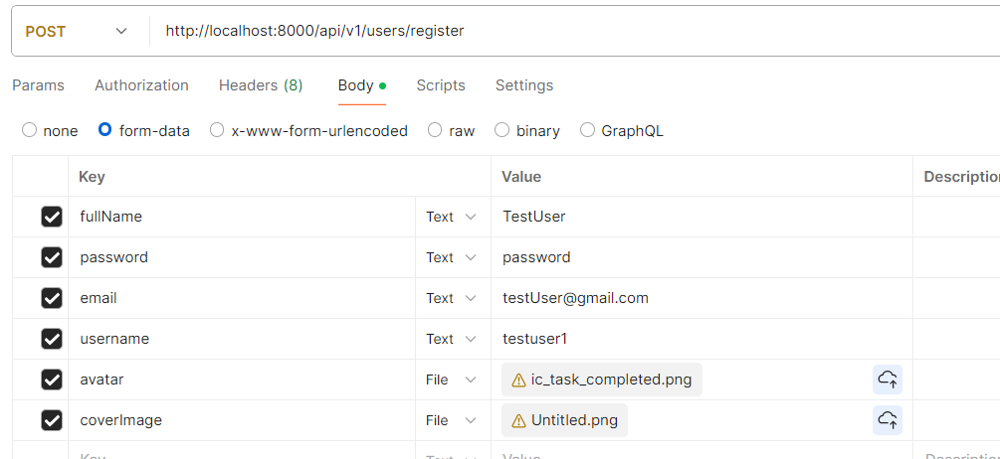

# How to use Postman for backend

- There is an organisated way ; we make certain collections and these are passed to frontend team .

- ## Let's Start 
  - Go to http://localhost:8000/api/v1/users/register  and hit the post request in the postman
  - In the body , select form-data and add all the data fields (key-value) required as written in the user.controller.js 
  - we are using form-data because raw-json can't have files
  
  - response will be in json format
```js
{
    "statusCode": 200,
    "data": {
        "_id": "66af0f8b55e35601c9f55d7e",
        "username": "testuser1",
        "email": "testuser@gmail.com",
        "fullName": "TestUser",
        "avatar": "http://res.cloudinary.com/dt58ebjgx/image/upload/v1722748808/ryllmkgmonemw1pivj20.png",
        "coverImage": "http://res.cloudinary.com/dt58ebjgx/image/upload/v1722748810/uqmejtjme4p5q4cciwbw.png",
        "watchHistory": [],
        "createdAt": "2024-08-04T05:20:11.424Z",
        "updatedAt": "2024-08-04T05:20:11.424Z",
        "__v": 0
    },
    "message": "User created successfully",
    "success": true
}
```

- Go check MOngoDb site ,  the browse collections : videotube 
  - check the user data there
- Go check on media explorer of cloudinary 
- Go check the public/temp folder
  - see the images are uploaded on local too 
- So , now we know images are uploaded on local , so we need to change in cloudinary.js file such that it is deleted from local once uploaded on cloudinary
```js
try {
        if(!localFilePath) return null 
        //upload the file on cloudinary
        const response = await cloudinary.uploader.upload(localFilePath, {
            resource_type: "auto",})
        // file has been uploade succesfully
       // console.log("File has been uploaded" , response.url);
       fs.unlinkSync(localFilePath);
        return response;
    } 
```


- Changing the check condition in user.controller.js
```js
// const coverImageLocalPath = req.files?.coverImage[0]?.path

   let coverImageLocalPath ;
   if( req.files && Array.isArray(req.files.coverImage) && req.files.coverImage.length > 0){
 
    coverImageLocalPath = req.files.coverImage[0].path
       
   }
```

- ## Some configurations in postmon
  - Make collections : folders in postman
  - make enviroment variables
    - instead of using http://localhost:8000/api/v1/users/register  , use {{server}}users/register
    - where {{server}} is variable set in environment 