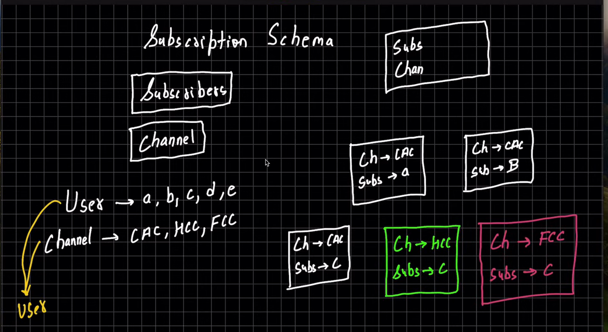

# Understanding subscription schema

- There are two things channel and subscribers
  - Let users be a , b, c , d (subscriber)
  - channel be CAC , HCC , FCC
- Each user can subscribe to multiple channels and vice versa
- So when 'a' subscribes to channel CAC , a new doc is compiled as shown 
- Similarly when 'a' subscribes to channel HCC , a new doc is compiled as shown
- So we can count the number of subscribers for each channel by counting the channel named doc ;
say for CAC , its three
- we can count the number of channel subscribed by a person by couting the doc on basis of user

